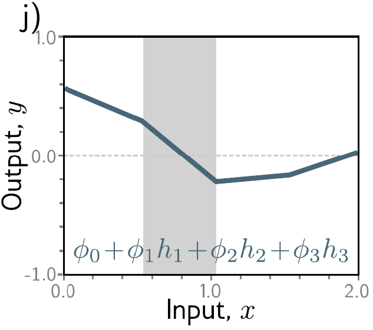
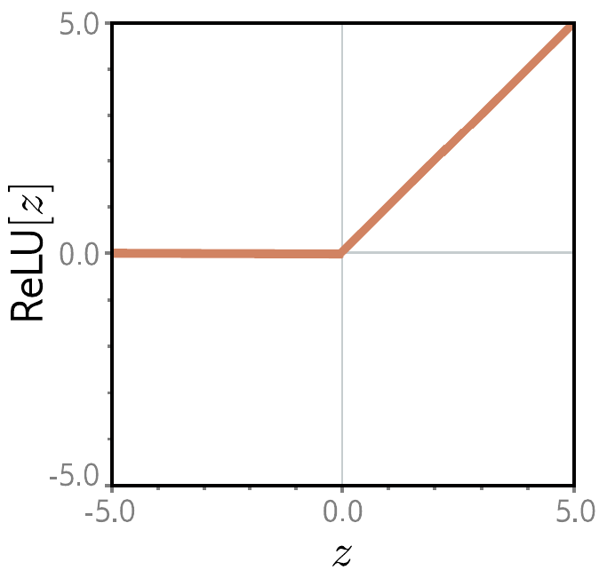
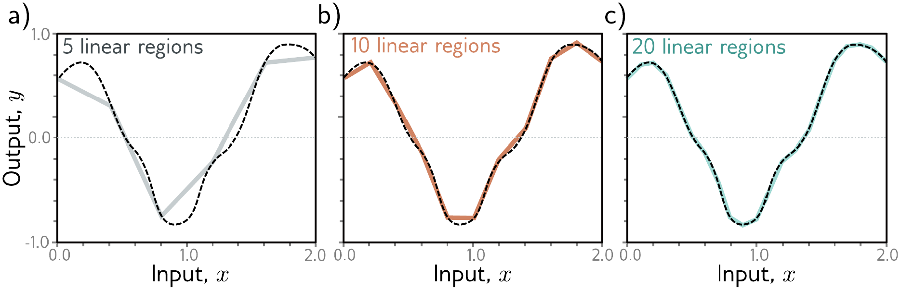
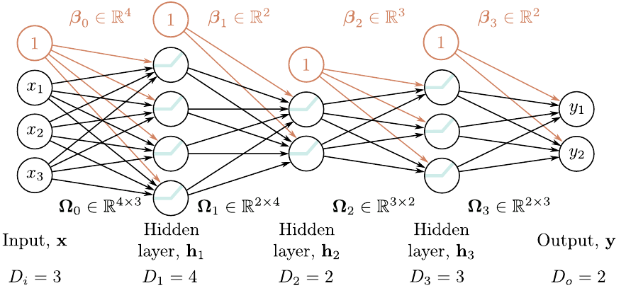

# Report – Week 02: Shallow & Deep Neural Networks

**Presenter:** Antonia Ponikarov  

**Date:** 27.10.2025  

## Summary
Linear models are limited to representing simple, linear relationships between input $x$ and output $y$. 
Consequently, certain problems cannot be solved using linear models, e.g. the XOR problem, which takes two binary 
inputs and produces a binary output. 
The output of the operation equals $1$ if and only if the two inputs differ. 
The corresponding data points are not linearly separable, meaning that there is no way to draw a single line to 
separate the two output classes.
That example illustrates the necessity of neural networks, which introduce nonlinearity through activation functions.
By composing multiple linear transformations with nonlinear activations, such models can represent flexible, 
piecewise-linear functions and are therefore capable of modeling more complex mappings relationships.

A shallow neural network can be defined as a function $\textbf{y} = \textbf{f} [\textbf{x}, \mathbf{\phi]}$,
parameterized by $\mathbf{\phi}$, which maps multivariate inputs $\textbf{x}$ to multivariate outputs $\textbf{y}$. 

**Basic structure:** \
Consider the example of a network with a scalar input $x$ and a scalar output $y$, parameterized by ten parameters 
$\mathbf{\phi} = \{\phi_0, \phi_1, \phi_2, \phi_3, \theta_{10}, \theta_{11}, \theta_{20}, \theta_{21}, \theta_{30}, \theta_{31}\}.$

<figure style="text-align: center;">
    
</figure>

The corresponding input/output mapping is given by 

$$y = f[x,\mathbf{\phi}] = \phi_0 + \phi_1 \text{a} [\theta_{10} + \theta_{11} x] + \phi_2 \text{a} [\theta_{20} + \theta_{21} x]+ \phi_3 \text{a} [\theta_{30} + \theta_{31} x].$$

Interpretation of Parameters:
- $\theta_{ij}$: parameters defining the linear transformations (intercept and slope) applied to the input
- $\text{a}[\cdot]$: nonlinear activation function
- $\phi_1, \phi_2, \phi_3$: output weights used to combine the activations
- $\phi_0$: offset/bias, which controls the height of the final function

As illustrated in the figure above, a shallow network consists of a single hidden layer, which in this example contains 
three hidden units, also referred to as neurons. 
Each hidden unit computes a small linear function of the input, such as $\theta_{10} + \theta_{11} x$.
Those intermediate values are known as pre-activations.
An activation function is then applied to each pre-activation, for example $h_1=\text{a}[\theta_{10} + \theta_{11} x]$. 
Finally, the network output is obtained by linearly combining all activations using the output weights and adding a bias.

    
    

The positions at which the hidden-unit contributions cross zero become the "joints" in the final output function. 
At these locations, the slope of the output changes, resulting in a piecewise-linear structure.
Each hidden unit contributes at most one such joint. 
Consequently, a shallow network with three hidden units can represent a function consisting up to four linear regions.

In the case of multivariate inputs and outputs, each hidden unit receives a weighted combination of all input 
dimensions rather than a single scalar input.
Similary, each output $y_j$ is formed as a weighted combination of all activations:

$$\displaystyle y_j = \phi_{j0} + \sum_{d = 1}^{D} \phi_{jd}h_d$$ 

where the hidden-unit activations are defined as:

$$\displaystyle h_d = \text{a}\left[\theta_{d0}+\sum_{i=1}^{D_i}{\theta_{di}x_i}\right],$$

with $\mathbf{x} \in \mathbb{R}^{D_i}$ denoting the input vector and $\textbf{y} \in \mathbb{R}^{D_j}$ the output vector.

**Activation Functions:** \
Neural Networks combine linear operations, such as weighted sums, with nonlinear activations. 
Without nonlinear activations, the composition of multiple layers would collapse to a single linear mapping, regardless 
of network depth. 
Activation functions therefore play a crucial role by introducing nonlinearity at each hidden unit, enabling neural 
networks to model nonlinear input/output mappings.

The most commonly used activation function is the Rectrified Linear Unit (ReLU). 
It keeps positive values unchanged while mapping negative values to zero, thereby inducing a piecewise-linear behavior. 
ReLU activations enable efficient optimization and often lead to sparse activations.
However, ReLU also suffers from the so-called "dying ReLU problem": 
if a neuron's pre-activation remains negative, its outputs and gradient become zero, preventing further updates of the 
corresponding weights during training.

<figure style="text-align: center;">
    
</figure>

This issue can be resolved by using variants such as the Leaky ReLU function, which assigns a small non-zero slope to 
negative input values and thus preserves gradient flow. 
Other activation functions, including the sigmoid, tanh, and Exponential Linear Unit (ELU), have also been proposed to 
address limitations of standard ReLU activations. 

**Universal Approximation Theorem:**\
The Universal Approximation Theorem states that, for any continuous function, there exists a shallow network that can 
approximate this function arbitrarily well, provided a sufficient number of hidden units is available. 
When ReLU activation functions are used, each hidden unit adds at most one joint to the resulting function. 
Consequently, a shallow network with $D$ hidden units can represent a piecewise-linear function consisting of at most 
$D$ joints and therefore at most $D+1$ linear regions. 
Increasing the number of hidden units increases the number of linear regions.
As the number of linear regions grows, each region covers a small section of the input domain, enabling the network to 
more closely match the shape of the true underlying continuous function. 
However, this theorem proves existence, not efficiency: 
while shallow networks are theoretically capable of approximating arbitrary continuous functions, they may need a large
amount of hidden units to do so accurately for complex functions.

<figure style="text-align: center;">
    
</figure>

**Limitations of Shallow Networks:** \
Approximating complex functions, especially in high dimensional input spaces, typically requires an impractically large 
number of hidden units. 
As a result, the number of parameters grows rapidly with both the input dimension and hidden units, leading to poor 
parameter inefficiency. 
In contrast, depth enables far more regions with fewer parameters, allowing deep neural networks to achieve the same 
expressivity.

<figure style="text-align: center;">
    
</figure>

**Deep Networks:**\
In contrast to shallow networks, which contain only a single hidden layer, deep neural networks consist of multiple 
hidden layer stacked sequentially. 

    
    

Composing two single-layer networks, each with three hidden units (see figure above on the left-hand side), results in 
the first network to create three alternating slopes, mapping the input domain into the interval $[-1, 1]$. 
The second network then applies a similar transformation to this intermediate representation. 
Through this repeated folding and reuse of input ranges, the composed network generates nine linear regions instead of 
three, as illustrated in the figure above on the right-hand side.

When two shallow networks are combined, it essentially yields a special case of a deep network with two hidden layers. 

<figure style="text-align: center;">
    
</figure>

The hidden units $h_1$, $h_2$ and $h_3$ in the first hidden layer are computed as usual by forming linear functions of 
the input and applying the ReLU activation function on them. 
Their outputs then serve as inputs to the second hidden layer, where the pre-activation values are computed by taking 
three new linear functions of these hidden units. 
At this point, there are three piecewise linear functions where the joints between linear regions are at the same 
places (see figure a)-c) below).
Applying a second ReLU activation to each function, introduces additional joints (see figure d)-f) below), further 
increasing the number of linear regions.
After weightening the functions and combining them together, the final output is a linear combination of these hidden 
units:

$$y' = \phi'_0 + \phi'_1h'_1 + \phi'_2 h'_2 + \phi'_3 h'_3.$$

<figure style="text-align: center;">
    
</figure>

**General Form - Matrix Notation:**\
A deep neural network with $K$ hidden layers can be compactly described as a sequence of linear transformations 
alternating with nonlinear activation functions:

$$
\begin{aligned}
\mathbf{h}_1 &= \mathbf{a}[\mathbf{\beta}_0 + \mathbf{\Omega}_0 \mathbf{x}] \\\\
\mathbf{h}_2 &= \mathbf{a}[\mathbf{\beta}_1 + \mathbf{\Omega}_1 \mathbf{h}_1] \\\\
\mathbf{h}_3 &= \mathbf{a}[\mathbf{\beta}_2 + \mathbf{\Omega}_2 \mathbf{h}_2] \\\\
&\vdots \\\\
\mathbf{h}_K &= \mathbf{a}[\mathbf{\beta}_{K-1} + \mathbf{\Omega}_{K-1} \mathbf{h}_{K-1}] \\\\
\mathbf{y} &= \mathbf{\beta}_K + \mathbf{\Omega}_K \mathbf{h}_K
\end{aligned}
$$

<figure style="text-align: center;">
    
</figure>

- $\mathbf{h}_k$ : vector of hidden units at layer $k$
- $\mathbf{\beta}_k$ : vector of biases that contributes to layer $k+1$
- $\mathbf{\Omega}_k$ : weights that are applied to $k^{\text{th}}$ layer and contributes to $(k + 1)^{\text{th}}$ - layer

**Depth vs. Width:**\
To sum up, both shallow and deep networks can approximate any continuous function given enough capacity.
However, depth provides a significantly more parameter-efficient means of achieving expressive power.
A shallow network with one input, one output and $D > 2$ hidden units can represent at most $D + 1$ linear regions 
using $3D + 1$ parameters. 
In contrast, a deep network with $K$ hidden layers of width $D > 2$ can create up to $(D+1)^k$ linear regions with a 
comparable parameter budget (exactly $3D + 1 + (K-1)D(D+1)$ parameters). 
The exponential growth in the number of linear regions explains why deep networks are particularly well suited for
modeling complex, structured data such as images. 
In practice, deep networks achieve state-of-the-art performance across most tasks.

## Discussion Notes

- **Why is ReLU the most used activation function in practice ?**

    **ReLU** is the most widely used activation function in practice because it offers
    a simple yet powerful balance between computational efficiency and effective gradient propagation.
  
    Other activation functions like **sigmoid** or **tanh**, for example, squash inputs into narrow ranges
    which makes their gradients very small for large input magnitudes ==> **Vanishing gradients** problem
    [(read more ...)](https://www.geeksforgeeks.org/deep-learning/vanishing-and-exploding-gradients-problems-in-deep-learning/)
  
    **ReLU** on the other hand allows gradients to flow efficiently through the different layers of the network.
    Its derivative of the output with respect to the input is always a constant **1**  for positive inputs.
    This helps to avoid the saturation problem (derivative becomes close to zero) for large input data that
    the derivatives of the **sigmoid** activation function suffer from.
  
    Another advantage of using **ReLU** is that it is extremely simple to compute (we just compare with zero and clip negative inputs)
    and has no exponentials or divisions like **sigmoid** or **tanh**.

- **Bias-Variance tradeoff :**
  
    When training our Neural Network/Model, our goal is to predict well on **new unseen** data.
    The **Bias-Variance tradeoff** describes how the model complexity affects prediction error, and why we
    need to balance **Underfitting** and **Overfitting**.

    **Bias** : 
     - Measures how far the model’s predictions are from the true function on average 
     - It represents systematic error (how much the model “misses the mark”) 
     - High bias ==> **Underfitting** (model too simple, can’t capture patterns)

    **Variance** : 
     - Measures how much the model’s predictions vary if we train it on different datasets drawn from the same distribution 
     - High variance means the model memorizes noise instead of learning the underlying patterns 
     - High variance ==> **Overfitting** (Model does not generalize well)

    **The Tradeoff** : 
     - Simple Network (*Low complexity*): if Bias **High** and Variance **Low** ==> **Underfitting** 
     - Complex Network (*High complexity*): if Bias **Low** and Variance **High** ==> **Overfitting**
 
    
  

- **What are the advantages of using Deep Neural Networks over Shallow ones ?**
  
    Deep Neural Networks are generally preferred over Shallow Neural Networks because they can model
    **complex patterns in data** more effectively thanks to their depth. While shallow networks can
    theoretically approximate any function, they would need an exponentially larger number of neurons
    to achieve the same level of performance ==> **Higher representation power**

    Deep Neural Networks tend also to **generalize better** on new unseen data. Shallow networks, on the
    other hand, often underfit and fail to capture the underlying structure of complex datasets ==> **Better generalization**

    Deep networks use their layers to build on previously learned features, allowing for the **reuse of information**.
    This means they can achieve strong performance without having to drastically increase the number of parameters,
    which makes them **more efficient** than wide shallow networks ==> **Parameter efficiency**

- **What does folding the input space actually mean ?**

Folding the input space can be seen as applying a nonlinear transformation that helps make complex patterns much simpler and separable; meaning, wraping, bending or stretching (...) the input space so that same label points cluster and lie together in a region that is easier to separate rather than these points being far apart or hard to   separate from other points in the original space.

## References

- Deep Learning using Rectified Linear Units (ReLU) [[Link]](https://arxiv.org/pdf/1803.08375)

- A Modern Take on the Bias-Variance Tradeoff in Neural Networks [[Link]](https://arxiv.org/pdf/1810.08591)

