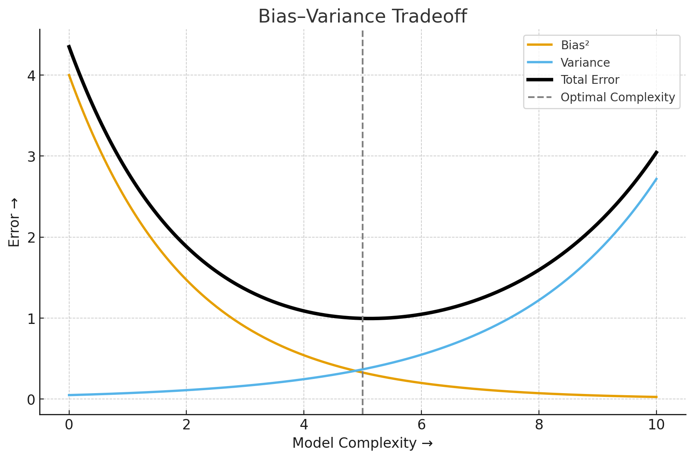
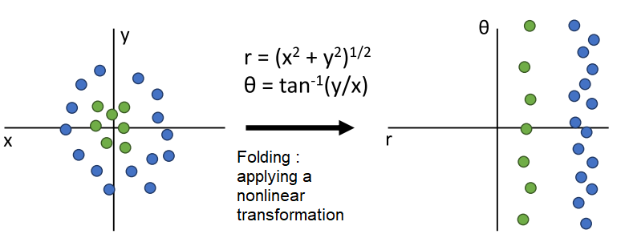

# Report – Week 02: Shallow & Deep Neural Networks

**Presenter:** [Name]  

**Date:** 27.10.2025  

## Summary

(1–2 page summary of key concepts, equations, and methods)

## Discussion Notes

- **Why is ReLU the most used activation function in practice ?**

    **ReLU** is the most widely used activation function in practice because it offers
    a simple yet powerful balance between computational efficiency and effective gradient propagation.
  
    Other activation functions like **sigmoid** or **tanh**, for example, squash inputs into narrow ranges
    which makes their gradients very small for large input magnitudes ==> **Vanishing gradients** problem
    [(read more ...)](https://www.geeksforgeeks.org/deep-learning/vanishing-and-exploding-gradients-problems-in-deep-learning/)
  
    **ReLU** on the other hand allows gradients to flow efficiently through the different layers of the network.
    Its derivative of the output with respect to the input is always a constant **1**  for positive inputs.
    This helps to avoid the saturation problem (derivative becomes close to zero) for large input data that
    the derivatives of the **sigmoid** activation function suffer from.
  
    Another advantage of using **ReLU** is that it is extremely simple to compute (we just compare with zero and clip negative inputs)
    and has no exponentials or divisions like **sigmoid** or **tanh**.

- **Bias-Variance tradeoff :**
  
    When training our Neural Network/Model, our goal is to predict well on **new unseen** data.
    The **Bias-Variance tradeoff** describes how the model complexity affects prediction error, and why we
    need to balance **Underfitting** and **Overfitting**.

    **Bias** : 
     - Measures how far the model’s predictions are from the true function on average 
     - It represents systematic error (how much the model “misses the mark”) 
     - High bias ==> **Underfitting** (model too simple, can’t capture patterns)

    **Variance** : 
     - Measures how much the model’s predictions vary if we train it on different datasets drawn from the same distribution 
     - High variance means the model memorizes noise instead of learning the underlying patterns 
     - High variance ==> **Overfitting** (Model does not generalize well)

    **The Tradeoff** : 
     - Simple Network (*Low complexity*): if Bias **High** and Variance **Low** ==> **Underfitting** 
     - Complex Network (*High complexity*): if Bias **Low** and Variance **High** ==> **Overfitting**
 
    
  

- **What are the advantages of using Deep Neural Networks over Shallow ones ?**
  
    Deep Neural Networks are generally preferred over Shallow Neural Networks because they can model
    **complex patterns in data** more effectively thanks to their depth. While shallow networks can
    theoretically approximate any function, they would need an exponentially larger number of neurons
    to achieve the same level of performance ==> **Higher representation power**

    Deep Neural Networks tend also to **generalize better** on new unseen data. Shallow networks, on the
    other hand, often underfit and fail to capture the underlying structure of complex datasets ==> **Better generalization**

    Deep networks use their layers to build on previously learned features, allowing for the **reuse of information**.
    This means they can achieve strong performance without having to drastically increase the number of parameters,
    which makes them **more efficient** than wide shallow networks ==> **Parameter efficiency**

- **What does folding the input space actually mean ?**

  folding the iput space can be seen as applying a nonlinear transformation that helps make complex patterns much       simpler and separable; meaning, wraping, bending or stretching (...) the input space so that same label points        cluster and lie together in a region that is easier to separate rather than these points being far apart or hard to   separate from other points in the original space.

  

## References

- Deep Learning using Rectified Linear Units (ReLU) [[Link]](https://arxiv.org/pdf/1803.08375)

- A Modern Take on the Bias-Variance Tradeoff in Neural Networks [[Link]](https://arxiv.org/pdf/1810.08591)

