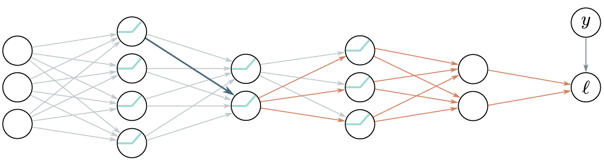

# Report – Week 5: Gradients & Initialization

**Presenter:** Noah Gövert  

**Date:** 17.11.2025 

---
## Summary
Now that we know how neural networks are structured, how we can apply loss functions to them, and how to minimize 
functions based on derivatives using methods like gradient descent, we will take a look at how to efficiently compute 
the derivatives of our neural network with the applied loss function with respect to its parameters. This will allow us 
to finally optimize our nets.

### Observations
The derivative of the loss function with respect to a certain parameter $\omega$ basically describes how a tiny change 
to this specific parameter would affect the output of the loss function. Based on that and the structure of a simple 
neural network as shown in Fig. 1 we can make the following two observations on how to compute the derivatives 
of the loss function with respect to the network's parameters.
1. The weights are always multiplied with the activations of a hidden unit and then added to the pre-activations of the 
following layer (blue arrow in Fig. 1). Therefore, we will save the activations during the computation of the loss 
function's output, which is also called the forward pass.
2. Small changes to weights or biases in early layers can cause a ripple effect through the whole network and 
completely alter the result. So in order to know how the change of a weight affects the loss function, we also need to 
know how all the subsequent layers change the output. We will quantize this effect of the subsequent layers as the 
upstream gradient and reuse this gradient to compute the upstream gradient for the previous layer and so forth. This is 
done during the so-called backward pass.

So in summary, we will compute the gradient by strategically saving and reusing important intermediate values during
the forward and backward pass.

### A toy example
In order to apply this intuition about gradient computation in neural networks we will now consider a simple 3 layer 
network $f[x,\phi]$ with least squares loss and a layer width of one. The $\sin$ function, the $\exp$ function and the 
$\cos$ function can be considered the activation functions.
$$
\ell_i[f[x,\phi],y_i]=[\beta_3+\omega_3\cdot\cos[\beta_2+\omega_2\cdot\exp[\beta_1+\omega_1\cdot\sin[\beta_0+\omega_0\cdot x]]]-y_i]^2
$$

#### Forward pass:
We can rewrite the loss function as the following chain of computations, where $f_i$ denotes the preactivations and 
$h_i$ the activations:
$$
\begin{aligned}
f_0 &= \beta_0 + \omega_0 \cdot x \\
h_1 &= \sin[f_0] \\
f_1 &= \beta_1 + \omega_1 \cdot h_1 \\
h_2 &= \exp[f_1] \\
f_2 &= \beta_2 + \omega_2 \cdot h_2 \\
h_3 &= \cos[f_2] \\
f_3 &= \beta_3 + \omega_3 \cdot h_3 \\
\ell_i &= [f_3 - y_i]^2
\end{aligned}
$$
In the forward pass we will then calculate the loss and save all the intermediate values from the chain of computations 
above.

#### Backward pass #1:
Now we will compute the derivatives with respect to our intermediate values in reverse order. Later we will then reuse 
these to calculate the derivatives with respect to our parameters.
The first derivative is straightforward:
$$
\frac{\partial \ell_i}{\partial f_3} = 2(f_3 - y_i)
$$
We can then go on and reuse this derivative in order to compute the derivative of our loss function with respect to 
$f_3$ using the chain rule:
$$
\frac{\partial \ell_i}{\partial h_3} = \frac{\partial f_3}{\partial h_3}\frac{\partial \ell_i}{\partial f_3}
$$
Then again, we can reuse the derivative computed above to calculate the derivative of the loss function with respect 
to $f_2$. And just like that, by always reusing the previous derivative with the chain rule, we can progress through 
the whole computation chain backwards until we get the derivative with respect to $f_0$. In the following computation 
the part in braces is always already fully computed one step before:
$$
\begin{aligned}
\frac{\partial \ell_i}{\partial f_2} &= \frac{\partial h_3}{\partial f_2}(\frac{\partial f_3}{\partial h_3}\frac{\partial \ell_i}{\partial f_3}) \\
\frac{\partial \ell_i}{\partial h_2} &= \frac{\partial f_2}{\partial h_2}(\frac{\partial h_3}{\partial f_2}\frac{\partial f_3}{\partial h_3}\frac{\partial \ell_i}{\partial f_3}) \\
\frac{\partial \ell_i}{\partial f_1} &= \frac{\partial h_2}{\partial f_1}(\frac{\partial f_2}{\partial h_2}\frac{\partial h_3}{\partial f_2}\frac{\partial f_3}{\partial h_3}\frac{\partial \ell_i}{\partial f_3}) \\
\frac{\partial \ell_i}{\partial h_1} &= \frac{\partial f_1}{\partial h_1}(\frac{\partial h_2}{\partial f_1}\frac{\partial f_2}{\partial h_2}\frac{\partial h_3}{\partial f_2}\frac{\partial f_3}{\partial h_3}\frac{\partial \ell_i}{\partial f_3}) \\
\frac{\partial \ell_i}{\partial f_0} &= \frac{\partial h_1}{\partial f_0}(\frac{\partial f_1}{\partial h_1}\frac{\partial h_2}{\partial f_1}\frac{\partial f_2}{\partial h_2}\frac{\partial h_3}{\partial f_2}\frac{\partial f_3}{\partial h_3}\frac{\partial \ell_i}{\partial f_3}) \\
\end{aligned}
$$

#### Backward pass #2:
Now that we computed all intermediate results and gradients in the forward and backward pass, we can finally compute 
the derivatives with respect to our weights $\omega$ and biases $\beta$. This again can be done using the chain rule:
$$
\begin{aligned}
\frac{\partial \ell_i}{\partial \omega_k} &= \frac{\partial f_k}{\partial \omega_k}\frac{\partial \ell_i}{\partial f_k} \\
\frac{\partial \ell_i}{\partial \beta_k} &= \frac{\partial f_k}{\partial \beta_k}\frac{\partial \ell_i}{\partial f_k}
\end{aligned}
$$
Notice that the right-hand side is just the upstream gradient computed in the step before. And the left-hand side is
easily computed:
$$
\begin{aligned}
\frac{\partial f_k}{\partial \omega_k} &= h_k \\
\frac{\partial f_k}{\partial \beta_k} &= 1
\end{aligned}
$$
With the exception for $k=0$:
$$
\frac{\partial f_k}{\partial \omega_k} = x_i
$$

This idea can also be extended to neural networks with a layer width of more than one. The central difference in that 
case would be that all computations are then done with vectors and matrices instead of scalars, but the general process 
remains the same.

### Algorithmic differentiation
The idea of treating formulas as a series of computations to then compute the derivatives of this formula with respect 
to each parameter by just applying the chain rule over and over again can be generalized to computational graphs. As 
long as a formula is transformable to a non-circular graph with the operators on its nodes, it is possible to 
automatically compute the derivatives with respect to all parameters. However, the derivatives for the operators on the 
graph's nodes have to be implemented beforehand. This leads to the practical advantage, that when creating neural 
networks in modern frameworks like PyTorch and TensorFlow, it usually is not necessary to implement derivatives at all, 
since standard derivatives, like addition, multiplication, and so forth, are already implemented by default.

### Initializing weights
Now that we fully understand how to optimize our networks from a certain starting point in the loss landscape, we still 
need to find a strategy to choose reasonable starting points. Hence, we need to find a reasonable way on how to 
initialize the network's weights and biases. One simple option would be to just randomly choose a single number, maybe 
even zero, and set all weights and biases to this specific number. Doing this, however, would lead to symmetries in the 
optimization process, and we would likely not be able to utilize the whole network's capacity. Another more practical 
approach would be to sample each weight independently of a standard normal distribution. Even though this is way closer 
to state-of-the-art weight sampling methods, it still leads to some problems.

#### Exploding and vanishing gradient problem
Assuming we have a neural network with ReLU activations, and we initialize our weights according to a standard normal 
distribution with $\mu = 0$ and a really small variance $\sigma^2$. If we would now propagate inputs through this 
layer, the average magnitude of the inputs for the next layer is likely smaller than the magnitude of the inputs of the 
layer before, since all inputs got multiplied with really small numbers, and then even all values less than zero got 
clipped by the ReLU function. If this happens consecutively in a lot of layers, the numbers might get so small that 
usual floating point precision does not have the capacity to represent these numbers accurately anymore. Something 
similar happens if we initialize our weights with a big variance, but in this case the magnitude of our values would 
rise uncontrollably from layer to layer instead of shrink, since the layer inputs are always multiplied with really big 
numbers.

The problem even increases during optimization in the backward pass, since the gradients here also get multiplied with 
the weight matrices, which leads to the so-called vanishing or exploding gradient problem. In Fig. 2 the development of
magnitude from the intermediate values in the forward pass and the gradients is shown for a network with 50 hidden 
layers, each with a width of 100 hidden units.

#### HE Initialization
As explained before, we have to be very careful with initializing our weights for big neural networks. In this section 
we will introduce an initialization method that samples weights from a standard normal distribution but adjusts the 
variance for each layer with the goal of keeping the magnitude of the preactivations the same for each layer.

We will find that the variance of pre activations $\sigma^2_{f'_i}$ in a subsequent layer in the forward pass of a 
simple feedforward network with ReLU activations depends as follows on the variance of the weights $\sigma_\Omega^2$, 
the variance of pre activations from its previous layer $\sigma_f^2$ and the number of hidden units $D_h$ in its 
previous layer:
$$
\sigma^2_{f'_i} 
= \frac{1}{2} D_h \, \sigma_\Omega^2 \, \sigma_f^2
$$
In order to keep the variance of pre-activations the same in both layers during the forward pass we can then just set 
the sampling variance for our weights as follows:
$$
\sigma^2 = \frac{2}{D_h}
$$

#### Initialization for backward pass
During the backward pass, a very similar argument can be made, with the main difference being that the weights are now 
multiplied with the transposed weight matrices. So in order to avoid vanishing or exploding gradients, we would have to 
divide by the dimensionality of the layer the weights feed into instead of the dimensionality of the layer the weights 
come from. 
$$
\sigma^2 = \frac{2}{D_{h'}}
$$
This initialization method, however, is directly in conflict with our optimal initialization method for the forward pass, 
if not all layers have the same size. One common option to tackle this problem is to just take the mean of both 
methods.
$$
\sigma_\Omega^2 = \frac{4}{D_h + D_{h'}}
$$

---
## Discussion Notes

**Q:** Is there a difference between computing the gradient for the combined loss (like it is done in Pytorch) vs. computing it "point-wise"? \
**A:** No, since mathematically there is no difference whether you differentiate first or you average first.

**Q:** How would you determine that your parameters were initialized poorly? \
**A:** You either get an exploding gradient or vanishing gradient. An exploding gradient may be visible in the loss because the loss becomes very volatile. A vanishing gradient might make it look like the loss is not changing at all anymore.

**Q:** In theory, what would happen if we intialized all weights with identical values? \
**A:** If all weights were the same, all the gradients would also be identical, meaning you would not be able to distinguish between neurons and the model could not describe anything useful.

**Q:** Regarding the formula for optimal initialization weights, where did the 2 come from? \
**A:** The 2 originally came from the observation that the ReLU discards half the values for μ=0, meaning it also halves the variance from one layer to the next.

**Q:** What is the difference between static and dynamic computation graphs in ML frameworks (i.e. Tensorflow vs. Pytorch)? \
**A:** In general, Tensorflow is faster, while Pytorch is more transparent, which is why researchers often use Pytorch. 

**Q:** We heard that backpropagation saves a lot of computation when computing the gradients. Are there also costs/ disadvantages to this approach? \
**A:** Since backpropagation saves many intermediate values for its next steps, it is not particularly memory efficient. There are approaches to cope with this, like only caching the most important values and re-computing other ones to save space, but it is always a space-time-tradeoff.

**Q:** The book said that one of the reasons that initialization is a potential problem is because of floating point precision. In theory, what would happen if we had infinite precision/ compute? \
**A:** At this point, the question becomes "Can I find the global minimum from any starting point?", which should be possible with infinite compute.

---
## References
- [Understand Deep Learning](https://udlbook.github.io/udlbook/)
