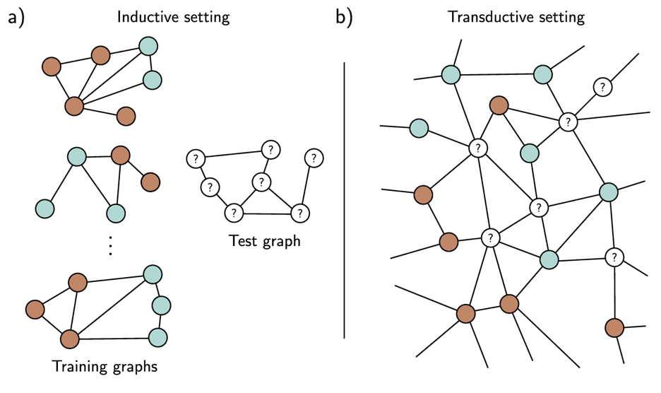
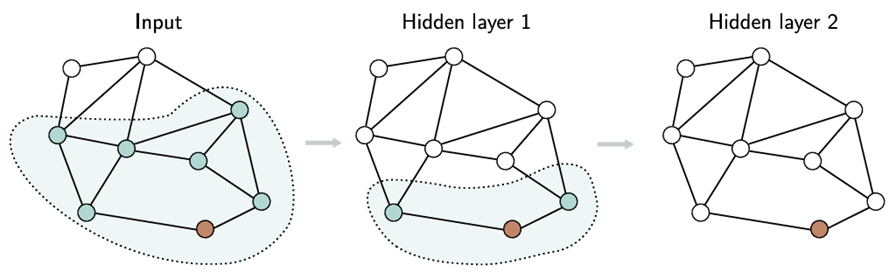

### Graph representation
Graphs consist of a set of nodes $N$ and edges $E$ that connect pairs of nodes and represent real-world objects such as road networks or electrical circuits. They can be directed or undirected and may also be multigraphs, allowing multiple edges between two nodes.

A graph structure is represented by an adjacency matrix $\mathbf{A}$, with entries indicating whether an edge should exist between two nodes. Additionally, a graph can store information via a node data matrix $\textbf{X}$ or an edge data matrix $\textbf{E}$. Both contain concatenated fixed-length vectors for each node or edge.

<figure style="text-align: center;">
    
</figure>

### Graph neural networks
Graph neural networks are models that take node embeddings and adjacency matrix as input and are processed through a series of $K$ layers. At the beginning, In each layer, the node embedding is updated which are defined as hidden representations $\mathbf{H}_K$. As a result, the model output contains information about the nodes and their context in the graph.

### Graph-level tasks
Supervised graph problems are subdivided into graph-level tasks, node-level tasks and edge-level tasks. Graph-level tasks assign a label or estimate one or more values for the entire graph such as identifying the temperature at which a molecule becomes liquid. Node-level tasks assign one or more values to each node of the graph, based on the graph structure and the node embeddings. Edge-level tasks predict whether an edge should exist between two nodes, for example, in a social network to determine if two people know each other.

### Graph convolutional networks
Spatial-based graph convolutional networks (GCNs) update each node by aggregating information from its neighboring nodes at each layer. Formally, this process can be represented by a function $\mathbf{F[\bullet]}$ with parameters $\Phi$ 
that takes the node embeddings and the adjacency matrix as input and outputs a new node embedding. This can be written as:

$$
\begin{aligned}
\mathbf{H}_1 &= \mathbf{F}[\mathbf{X}, \mathbf{A}, \phi_0] \\
\\
\mathbf{H}_2 &= \mathbf{F}[\mathbf{H_1}, \mathbf{A}, \phi_1] \\
\\
\mathbf{H}_3 &= \mathbf{F}[\mathbf{H_2}, \mathbf{A}, \phi_2] \\
\\
&\vdots \\
\\
\mathbf{H}_K &= \mathbf{F}[\mathbf{H_{k-1}}, \mathbf{A}, \phi_{k-1}] \\
\end{aligned}
$$

The nodes are arbitrarily indexed, making each layer equivariant: permuting the node indices also permutes the node embeddings. The output is invariant to the node order, so permuting the node indices does not affect it.
An example application for a GCN is the classification of molecules as either harmless or toxic.

### Inductive vs. transductive models
Inductive models uses a training set of labeled data to learn the relationship between the input and the output. This relationship is then applied to new, unseen test data. In contrast, transductive models use both labeled and unlabeled data simultaneously and produce only labels for the unlabeled data rather than as a general rule.

As an example binary node classification is transductive: the goal is to label the remaining unlabeled nodes from a large graph. However, two problems arise: The graph cannot be stored logistically due to its size and having only a single graph makes the application of a stochastic gradient descent difficult.

<figure style="text-align: center;">
    
</figure>

### Choosing batches
To address this, a subset of nodes is selected as a batch. For each of node, its receptive field (k-hop neighborhood) is considered allowing to get input from nearby nodes in the previous layer. A gradient descent step is applied over the union of the k-hop neighborhoods of the nodes, while the remaining nodes do not contribute. However, with a densely connected graph and many layers, the size remains large.

<figure style="text-align: center;">
    
</figure>

Two approaches address this: First, neighbor sampling uses a random subset of neighbor nodes as input, with a fixed number of neighbors. Second, graph partitioning divides the graph into smaller subgraphs that are used as training batches in a transductive setting.

### Layers for graph convolutional networks
There are several ways to aggregate the information from the nodes for the layers in a GCN. One method is that the current node gathers information from its neighbors by summing them up. Another approach is to take the average instead of the sum to make the aggregation independent of the number of neighbors. These aggregation methods depend on the graph topology and the weight of the contribution of the neighbors equally.

In contrast, there exists a graph attention layer where the weights depend on the data at the nodes. Such layers are used in a graph attention network. The basic idea is as follows: a linear transformation is applied to the current node embedding. Then, the similarity to every node is computed by using a pre attention matrix. In the end, an attention matrix is applied to ensure that only the values of the node itself and its neighbors contribute to the node embedding.

<figure style="text-align: center;">
    
</figure>

### Edge graphs
To process information for edge embeddings instead of node embeddings, the graph is transformed into its edge graph by placing a node on each original edge and connecting these new nodes if they share an original node. The original nodes are removed during the process.

# Report - Week 7, Chapter 13: Graph Neural Networks

**Presentation Date:** 08.12.2025\
**Presenter:** Nhat Vu Minh\
**Discussion Lead:** Aisaiah Pellecer\
**Report by:** Aisaiah Pellecer

## Graph Representation

A graph consists of a set of nodes connected by edges. Both nodes and edges may carry information in the form of node embeddings and edge embeddings. 

Graphs are a natural way to represent structured data where relationships between entities are important, such as social networks, citation graphs, and molecular structures.

In some cases, edges themselves can be treated as nodes by constructing an edge graph, which allows graph neural networks to update edge embeddings using the same message-passing mechanisms applied to nodes.

## Graph Neural Networks (GNNs)

A graph neural network is a model that takes the node embeddings *X* and the adjacency matrix *A* as inputs and processes them through a sequence of *K* layers. At each layer, node embeddings are updated, producing intermediate hidden representations $H_{k}$, until final output embeddings $H_{K}$ are obtained.

Initially, each node embedding contains information only about the node itself. As embeddings pass through successive layers, information from neighboring nodes is incorporated through message passing. By the final layer, each node embedding captures both the node’s own features and its context within the graph.

This process is analogous to word embeddings in transformer models: while input embeddings represent individual words in isolation, the output embeddings represent word meanings conditioned on their surrounding context.

Since node ordering in graphs is arbitrary, GNN layers must be permutation equivariant with respect to node indices. Parameter sharing across nodes enables generalization across graphs of different sizes and structures.

## Tasks in Graph Neural Networks

Graph neural networks can be applied to three main types of tasks:

- **Edge prediction tasks:**  
  The model predicts whether an edge should exist between two nodes. This is commonly used for link prediction and recommendation problems.

- **Node-level tasks:**  
  The model assigns a label (classification) or continuous values (regression) to each node. Predictions depend on both node embeddings and the graph structure, allowing nodes to be interpreted in context.

- **Graph-level tasks:**  
  The model assigns a label or predicts one or more values for the entire graph, exploiting global structural information and node embeddings.

Node- and edge-level tasks require permutation-equivariant outputs, while graph-level tasks require permutation-invariant functions.

## Spatial-Based Graph Convolutional Networks (GCNs)

Spatial-based graph convolutional networks update node representations by aggregating information from neighboring nodes in the original graph. They are referred to as convolutional because the same local aggregation rule is applied at every node.

These models induce a relational inductive bias, favoring information from nearby nodes, and are considered spatial-based because they operate directly on the given graph structure rather than transforming the graph into another domain.

## Inductive vs. Transductive Models

Graph-level tasks occur exclusively in the inductive setting, where the model is trained on a set of graphs and evaluated on unseen graphs.

Node-level and edge prediction tasks can occur in both settings:

- In the transductive setting, learning takes place on a single large graph with partial labels. The loss function is computed only where ground truth is known, while predictions for unlabeled nodes or edges are obtained by running a forward pass and reading out the corresponding outputs. Unlabeled nodes still influence learning through message passing.

- In the inductive setting, the model is trained on multiple graphs or subgraphs and can generalize to unseen nodes or graphs. Partitioning large graphs into subgraphs can effectively convert a transductive problem into an inductive one.

---

## Layers for Graph Convolutional Neural Networks (GCNNs)

A typical GCNN layer consists of:
1. Aggregation of neighbor information (mean, sum, or max)
2. Combination with the node’s current embedding
3. Non-linear transformation using shared parameters

Stacking multiple layers increases the receptive field (region of the graph that contributes to a given node), allowing nodes to incorporate information from multi-hop neighborhoods of batch nodes-- think of this as neighborhood sampling or graph partitioning. 

---

## Discussion Notes

### Key Questions and Responses

**Why are graphs in a batch treated as disjoint components of a single large graph?**  
This allows efficient batching and parallel computation. Since message passing only occurs along edges, disconnected graphs do not exchange information. However, unbalanced graphs may dominate gradient updates and affect training stability.

**How is unlabeled data used in transductive learning?**  
Unlabeled nodes participate in message passing and influence node embeddings, acting as a form of semi-supervised learning. Class imbalance within a single large graph can introduce bias.

**What is the receptive field in GNNs?**  
The receptive field corresponds to the *k*-hop neighborhood of a node, where *k* is the number of GNN layers.

**Do unbalanced partitions affect training?**  
Yes. Large or dense subgraphs can dominate gradients. Further partitioning improves efficiency but may increase bias by removing long-range dependencies.

**What is diagonal enhancement?**  
Diagonal enhancement adds self-loops to preserve node identity and stabilize message passing.

**Why use mean aggregation?**  
Mean aggregation normalizes by neighborhood size, leading to more stable training and better inductive generalization across graphs with varying node degrees.

## References

- Deep Learning using Rectified Linear Units (ReLU) [[Link]](https://arxiv.org/pdf/1803.08375)
